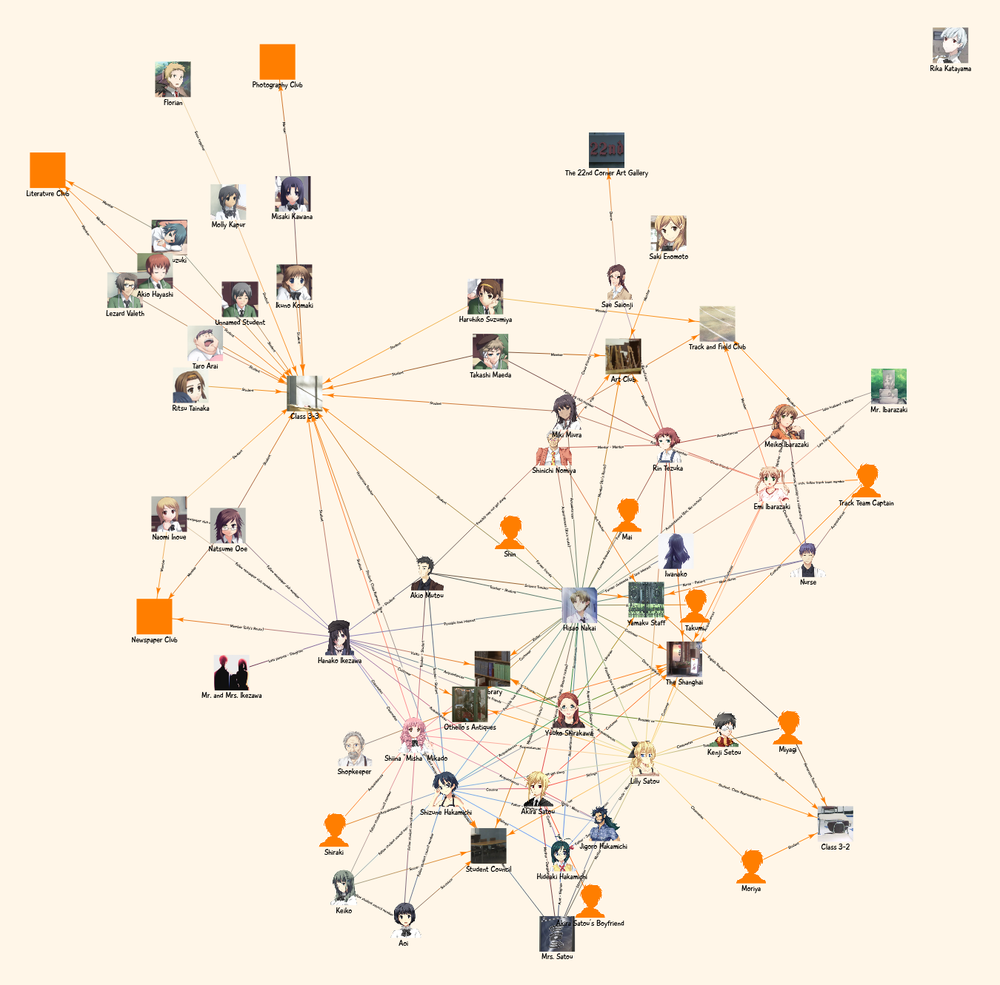

# Katawa Shoujo Character Relation Graph
Interactive network graph visualizing Katawa Shoujo characters and their relations.

References:
- https://katawashoujo.fandom.com/wiki/Category:Characters
- https://www.katawa-shoujo.com/characters.php
- https://katawashoujo.fandom.com/wiki/Category:Yamaku_Students
- https://katawashoujo.fandom.com/wiki/Hisao_Nakai
- https://katawashoujo.fandom.com/wiki/Category:Yamaku_High_School
- https://katawashoujo.fandom.com/wiki/Category:Places
- https://www.spriters-resource.com/pc_computer/katawashoujo/

## GitHub Pages
https://hyssopi.github.io/Katawa-Shoujo-Character-Relation-Graph/

## Prerequisites
- (To build) `npm` installed.

## Build
Run `npm run webpack`.

## Run
Open `index.html` in a web browser.

## Test
(None)
